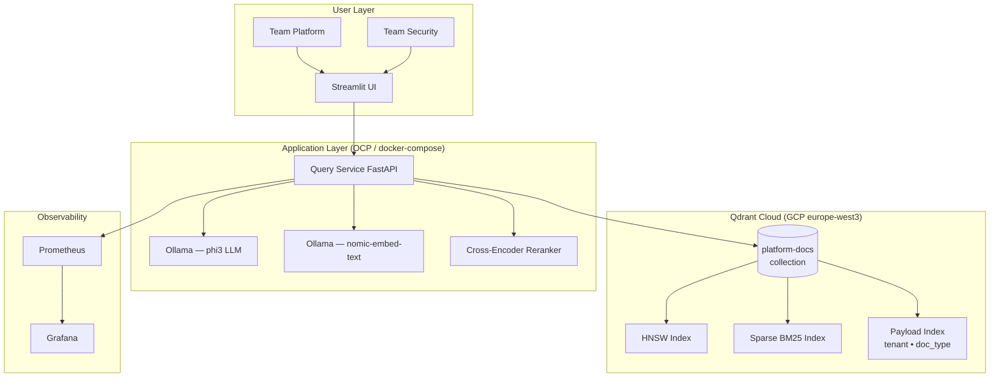

# Week 5 — Final Showcase Demo

**Goal:** Build a demo you can show in an interview, publish on GitHub, and
turn into a blog post. Must include: hybrid search, reranking, multi-tenancy,
observable, and production-style architecture.

**Time:** 5–7 days  
**Prerequisites:** All previous weeks complete

---

## Demo theme: Secure Multi-Tenant Platform Knowledge Assistant

A RAG platform where:
- **Team Platform** queries Vault/Consul/OCP operational docs (their tenant)
- **Team Security** queries security policies and PKI configurations (their tenant)
- Both teams use the same Qdrant Cloud cluster with payload-based isolation
- Every query shows: retrieval scores, source docs, tenant isolation proof,
  hybrid vs dense comparison, and optional reranking toggle

---

## Architecture

---

## Showcase checklist

- [ ] Qdrant Cloud connected (no local StatefulSet)
- [ ] Collection with dense + sparse vectors (hybrid search)
- [ ] Payload indexes on `tenant` and `doc_type`
- [ ] Two tenants with different document sets
- [ ] Query UI with tenant selector
- [ ] Toggle: dense-only vs hybrid search
- [ ] Toggle: with reranking vs without
- [ ] Collection info endpoint surfaced in UI
- [ ] Retrieval scores and sources shown
- [ ] MRR@5 baseline documented
- [ ] At least one failure scenario documented (what happens with wrong ef, bad chunking)

---

## Blog post outline

1. Problem: why RAG fails at enterprise scale
2. Architecture: Qdrant Cloud + OCP + Ollama
3. Collections explained (not just "add data")
4. Multi-tenancy: payload filter approach with real code
5. Hybrid search: when BM25 catches what embeddings miss
6. Reranking: the last-mile quality improvement
7. Observability: what metrics you need
8. Lessons: what I'd do differently

---

## Interview closing argument

When asked "Why Qdrant?":

> "Qdrant is the only open-source vector database designed from the ground up
> for production workloads. Key differentiators: native sparse+dense hybrid
> search in one system (no external BM25 layer), payload indexes that make
> tenant isolation fast without schema overhead, quantization with rescoring
> that gives you 4x memory reduction at <2% recall loss, and a Python client
> that mirrors the REST API exactly. For a cloud-native team already on
> Kubernetes, Qdrant Cloud eliminates stateful set management while giving
> you the same API as self-hosted — no vendor lock-in on the application layer."
